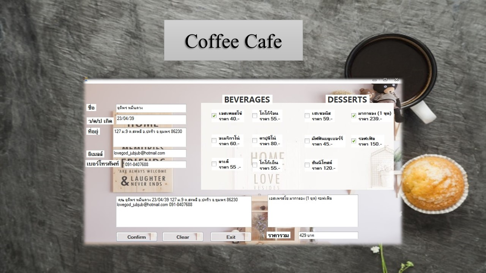
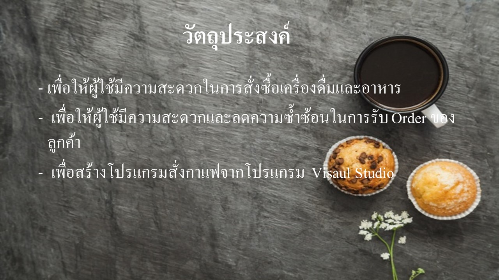
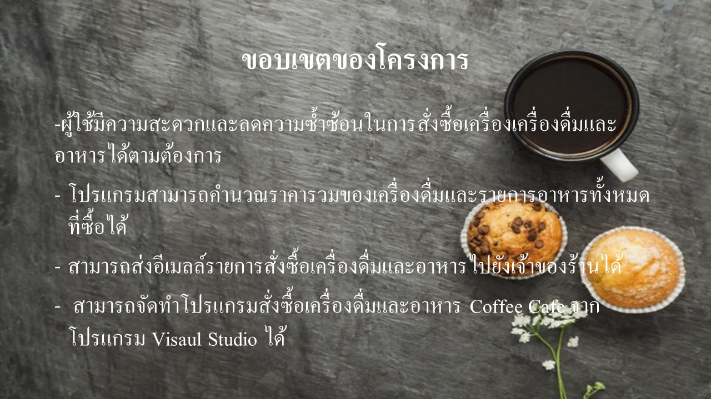
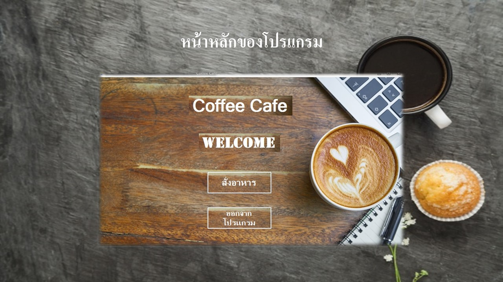
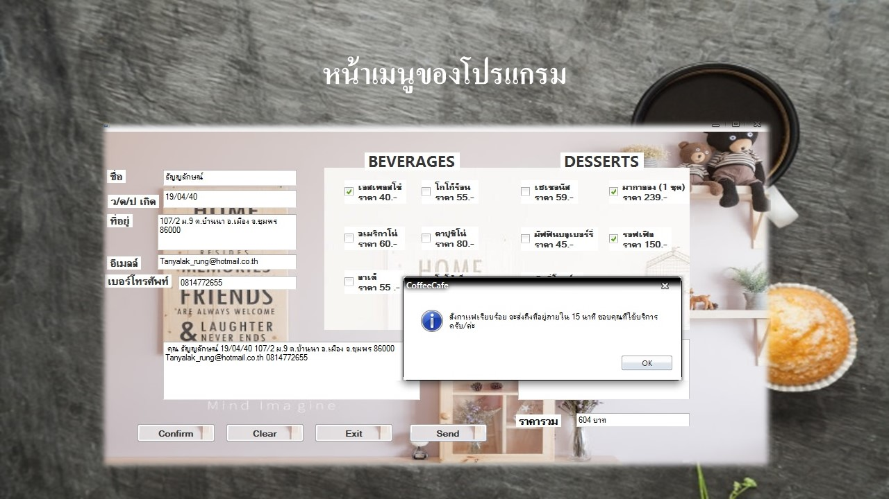
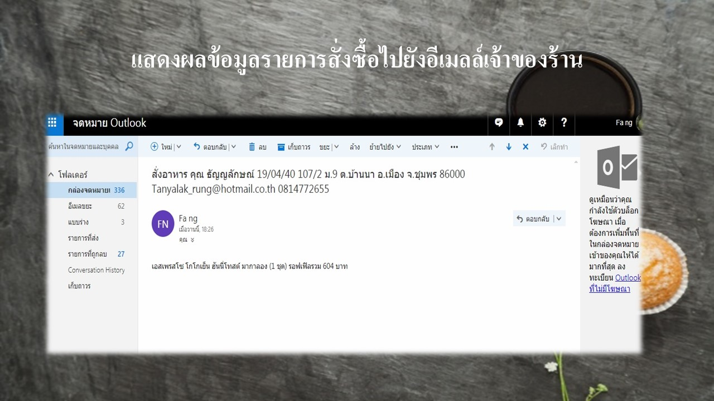

## "Homework of 308-364 ADVANCE WEB PROGRAMMING [1/62]"

You can use the [editor on GitHub](https://github.com/FangJutiporn/5810210080.github.io/edit/master/index.md) to maintain and preview the content for your website in Markdown files.

### รายชื่อสมาชิก

นางสาวจุติพร        หมื่นดวง         รหัส 5810210080
นางสาวธัญญลักษณ์   สุขสำเภา         รหัส 5810210758

### วัตถุประสงค์

เพื่อให้ผู้ใช้มีความสะดวกในการสั่งซื้อเครื่องดื่มและอาหาร
เพื่อให้ผู้ใช้มีความสะดวกและลดความซ้ำซ้อนในการรับ Order ของลูกค้า
เพื่อสร้างโปรแกรมสั่งกาแฟจากโปรแกรม  Visaul Studio

### ขอบเขตของโครงการ

ผู้ใช้มีความสะดวกและลดความซ้ำซ้อนในการสั่งซื้อเครื่องเครื่องดื่มและอาหารได้ตามต้องการ
โปรแกรมสามารถคำนวณราคารวมของเครื่องดื่มและรายการอาหารทั้งหมดที่ซื้อได้
สามารถส่งอีเมลล์รายการสั่งซื้อเครื่องดื่มและอาหารไปยังเจ้าของร้านได้
สามารถจัดทำโปรแกรมสั่งซื้อเครื่องดื่มและอาหาร Coffee Cafe จาก โปรแกรม Visaul Studio ได้

### รูปเพิ่มเติม

